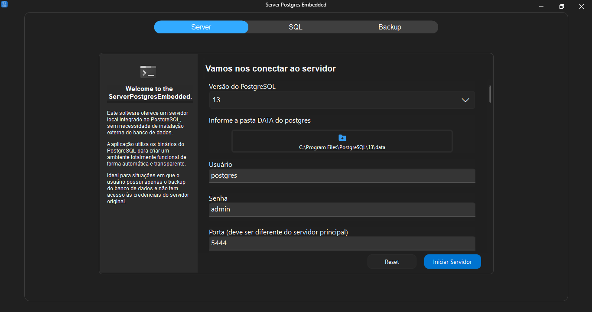
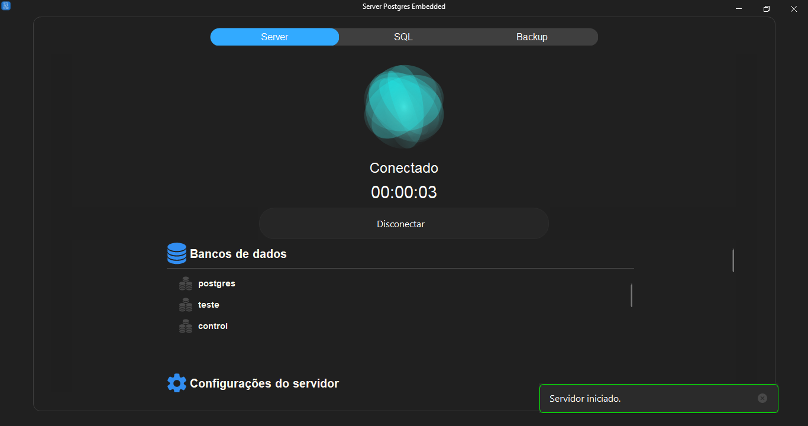

# PostgreSQL Embedded Server

Este é um projeto desenvolvido em **Delphi** que permite **embutir e controlar uma instância do servidor PostgreSQL** diretamente dentro de uma aplicação desktop.

> ⚙️ **Objetivo do Projeto**  
> Este projeto foi criado com o intuito de **acessar bancos de dados PostgreSQL apenas com a pasta `data`**, **sem precisar das credenciais do servidor original**. Isso é especialmente útil para realizar **conversões de dados de sistemas que utilizam PostgreSQL**, facilitando a migração e análise de dados de forma rápida e autônoma.

---

## 🛠 Funcionalidades

- ✅ Inicia o servidor PostgreSQL usando `pg_ctl`
- 🔍 Verifica se o servidor está em execução
- 🛡 Atualiza automaticamente o arquivo `pg_hba.conf`, alterando autenticações `md5` ou `scram-sha-256` para `trust`
- 💡 Uso local e embarcado em **Windows**

---

## 🧰 Tecnologias Utilizadas

- **Delphi (VCL)**
- **Codrut Fluent Design System - VCL Components**
- **Binários do PostgreSQL**
- **API do Windows** (`CreateProcess`, `ReadPipe`, etc.)
- **FireDAC** (opcional, para conexão e manipulação dos dados do banco)

